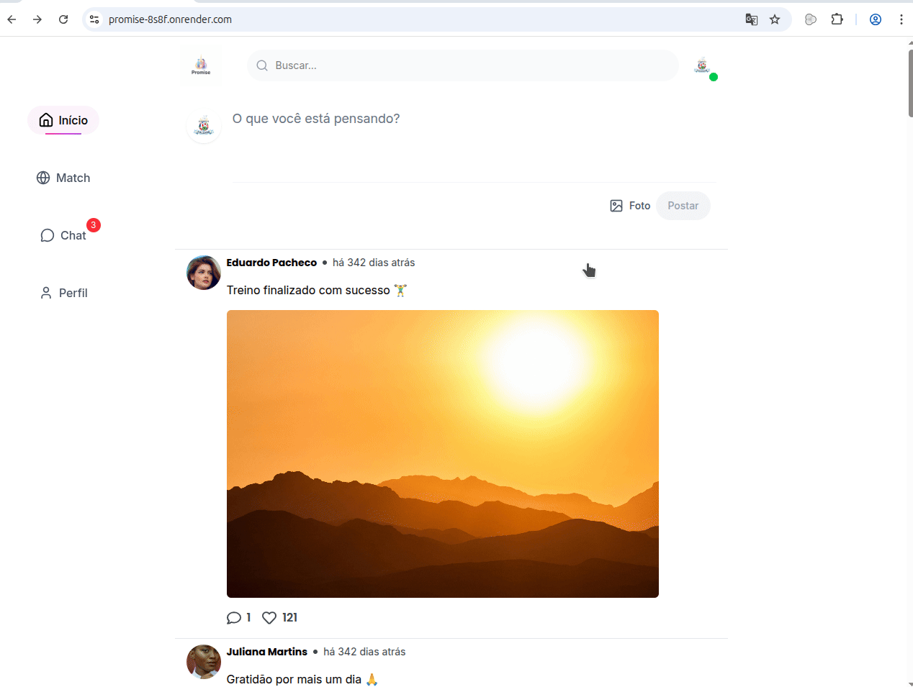

# Promise


Aqui está um **modelo de README profissional para o seu projeto Promise**. Esse formato é muito usado em projetos de portfólio no GitHub.

---

# Promise

Web App de relacionamento criado para ajudar pessoas a fazer novas amizades, conhecer novas pessoas e desenvolver relacionamentos de forma saudável dentro de uma comunidade com valores e princípios cristãos.

O projeto foi desenvolvido com foco em **experiência do usuário, performance e organização de código**, utilizando tecnologias modernas do ecossistema React.

---

## Visão Geral

O **Promise** é uma aplicação web que permite que usuários criem perfis, explorem outras pessoas na plataforma e se conectem com quem compartilha interesses e valores semelhantes.

A aplicação foi construída com uma arquitetura moderna de frontend, priorizando **componentização, escalabilidade e performance**.

---

## Funcionalidades

- Criação e gerenciamento de perfil de usuário
- Explorar e conhecer novas pessoas na plataforma
- Interface moderna e responsiva
- Upload e compressão de imagens de perfil
- Navegação fluida e otimizada
- Estrutura modular baseada em componentes reutilizáveis

---

## Tecnologias Utilizadas

- React
- TypeScript
- Vite
- Tailwind CSS v4
- React Hook Form
- Zustand
- Swiper
- Lucide React
- React Icons
- React Rewards
- Browser Image Compression
- PNPM

---

## Aprendizados no Projeto

Durante o desenvolvimento deste projeto foi possível aprofundar conhecimentos em:

- Estruturação de aplicações React escaláveis
- Gerenciamento de estado global com Zustand
- Validação e gerenciamento de formulários com React Hook Form
- Organização de componentes reutilizáveis
- Otimização de performance em aplicações web

---

## Instalação

Clone o repositório:

```bash
git clone https://github.com/seu-usuario/promise.git
```

Entre na pasta do projeto:

```bash
cd promise
```

Instale as dependências:

```bash
pnpm install
```

Execute o projeto:

```bash
pnpm dev
```

---

## Demonstração




Link da aplicação:
(adicione aqui quando tiver deploy)

---

## Autor

Tiago Santos

GitHub: [https://github.com/Tyago-santos](https://github.com/Tyago-santos)
LinkedIn: [https://www.linkedin.com/in/tiago-santos-9b8a1b1a0/](https://www.linkedin.com/in/tiago-santos-9b8a1b1a0/)
