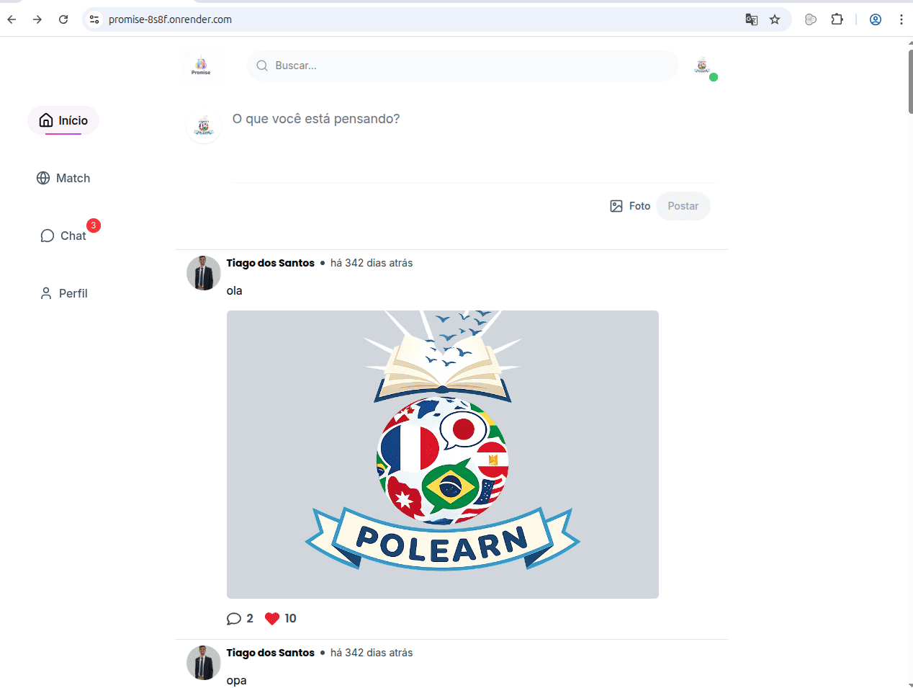

# Promise


Web App de relacionamento criado para ajudar pessoas a fazer novas amizades, conhecer novas pessoas e desenvolver relacionamentos de forma saudável dentro de uma comunidade com valores e princípios cristãos.

O projeto foi desenvolvido com foco em **experiência do usuário, performance e organização de código**, e é organizado como um monorepo com um backend e um frontend separados.

---

## Visão Geral

O **Promise** é uma aplicação web que permite que usuários criem perfis, explorem outras pessoas na plataforma e se conectem com quem compartilha interesses e valores semelhantes.

A aplicação foi construída com uma arquitetura moderna de frontend e backend separados, priorizando **componentização, escalabilidade e performance**.

---

## Funcionalidades

- Criação e gerenciamento de perfil de usuário
- Explorar e conhecer novas pessoas na plataforma
- Interface moderna e responsiva
- Upload e compressão de imagens de perfil
- Navegação fluida e otimizada
- Estrutura modular baseada em componentes reutilizáveis

---

## Tecnologias Utilizadas

**Frontend** (`frontend/`)
- React
- TypeScript
- Vite
- TanStack Router / TanStack Query
- Tailwind CSS v4
- React Hook Form
- Zustand
- Swiper
- Lucide React
- React Icons
- React Rewards
- Browser Image Compression

**Backend** (`backend/`)
- Node.js + Express
- TypeScript
- Prisma ORM + PostgreSQL
- Socket.IO (chat em tempo real)
- JWT + bcrypt (autenticação)
- Zod (validação)
- Multer (upload de imagens)

**Infra**
- Docker + Docker Compose
- PNPM

---

## Aprendizados no Projeto

Durante o desenvolvimento deste projeto foi possível aprofundar conhecimentos em:

- Estruturação de aplicações React escaláveis
- Gerenciamento de estado global com Zustand
- Validação e gerenciamento de formulários com React Hook Form
- Organização de componentes reutilizáveis
- Otimização de performance em aplicações web

---

## Estrutura do Projeto

```
promise/
├── backend/    # API REST (Express + Prisma + PostgreSQL)
├── frontend/   # SPA (React + Vite)
└── docker-compose.yml
```

Cada pasta é um projeto Node independente, com seu próprio `package.json` e `pnpm-lock.yaml`.

---

## Instalação

Clone o repositório:

```bash
git clone https://github.com/seu-usuario/promise.git
cd promise
```

### Opção 1: Docker Compose (recomendado)

Sobe o PostgreSQL, o backend e o frontend juntos:

```bash
docker compose up --build
```

- Frontend: http://localhost:3000
- Backend: http://localhost:3333

### Opção 2: Rodando localmente

**Backend**

```bash
cd backend
pnpm install
cp .env.example .env   # configure DATABASE_URL, JWT_SECRET etc.
pnpm prisma:migrate
pnpm dev
```

**Frontend** (em outro terminal)

```bash
cd frontend
pnpm install
pnpm dev
```

---

## Deploy

Backend na **Render** e frontend na **Vercel**, com Postgres/Storage no **Supabase**.

### Backend (Render)

O repositório já inclui um [`render.yaml`](render.yaml) (Blueprint) configurado para o serviço `promise-backend`, com `rootDir: backend`, build (`prisma generate` + `tsc`) e start (`prisma migrate deploy` + `node dist/server.js`) já prontos.

1. No painel da Render: **New > Blueprint**, aponte para este repositório.
2. Preencha as variáveis marcadas como `sync: false` no `render.yaml` (não versionadas):
   - `DATABASE_URL` e `DIRECT_URL` (pooler do Supabase — ver [.env.example](backend/.env.example))
   - `CORS_ORIGIN` (URL(s) do frontend na Vercel, separadas por vírgula)
   - `SUPABASE_URL`, `SUPABASE_ANON_KEY`, `SUPABASE_SERVICE_ROLE_KEY`
   - `JWT_SECRET` é gerado automaticamente pela Render.
3. A Render injeta `PORT` automaticamente; a API já lê essa variável.

Alternativamente, é possível fazer deploy usando o [`Dockerfile`](backend/Dockerfile) já existente (Render também suporta runtime Docker).

### Frontend (Vercel)

1. Importe o repositório na Vercel e defina o **Root Directory** como `frontend` (monorepo).
2. Framework preset **Vite** é detectado automaticamente (`pnpm build`, saída em `dist`).
3. Configure a env var `VITE_API_URL` com a URL pública do backend na Render (ex.: `https://promise-backend.onrender.com`).
4. O [`frontend/vercel.json`](frontend/vercel.json) já cuida do rewrite de SPA (rotas do TanStack Router funcionam em refresh/link direto).

> Depois de configurado, atualize `CORS_ORIGIN` no backend com a URL final da Vercel (e, se quiser, os domínios de preview) e o link abaixo em "Demonstração".

---

## Demonstração




Link da aplicação:
(adicione aqui quando tiver deploy)

---

## Autor

Tiago Santos

GitHub: [https://github.com/Tyago-santos](https://github.com/Tyago-santos)
LinkedIn: [https://www.linkedin.com/in/tiago-santos-9b8a1b1a0/](https://www.linkedin.com/in/tiago-santos-9b8a1b1a0/)
